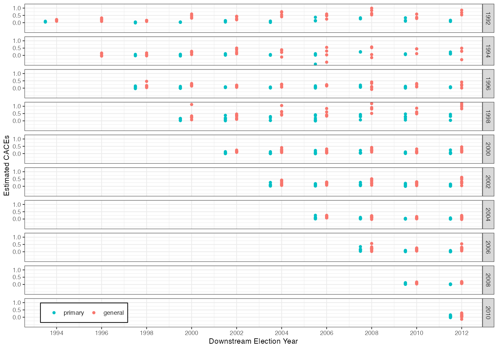
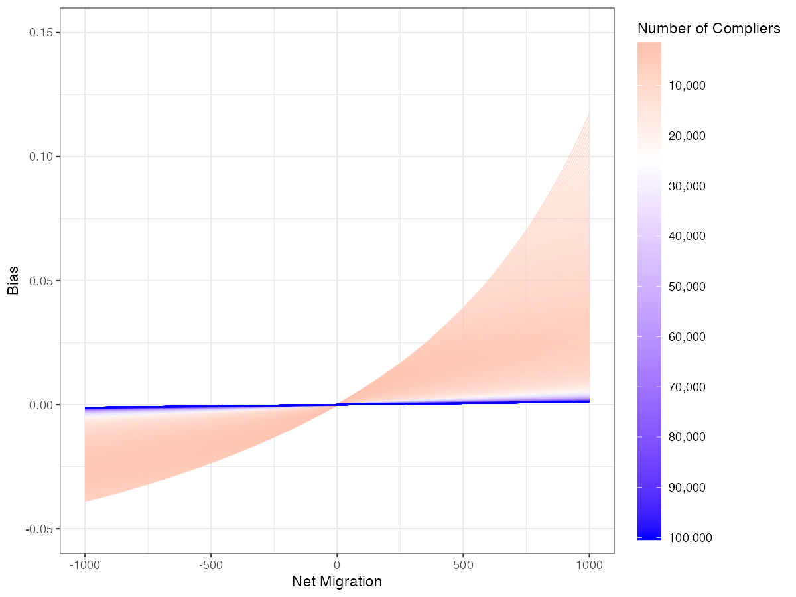

# Active Maintenance Report: coppock_green_2016


- [Paper overview](#paper-overview)
- [Summary](#summary)
  - [Does the deposited archive run?](#does-the-deposited-archive-run)
  - [Does the maintained rewrite reproduce the
    paper?](#does-the-maintained-rewrite-reproduce-the-paper)
- [Original archive reproducibility](#original-archive-reproducibility)
- [The extraction and the two
  instruments](#the-extraction-and-the-two-instruments)
- [Number-by-number comparison](#number-by-number-comparison)
  - [Float coverage](#float-coverage)
  - [Where the numbers disagree](#where-the-numbers-disagree)
- [Errata](#errata)
  - [Corrections the rewrite made to the deposited
    code](#corrections-the-rewrite-made-to-the-deposited-code)
- [Maintained rewrite](#maintained-rewrite)
  - [Architecture](#architecture)
- [Figure verification](#figure-verification)
- [Fixed-effects and random-effects
  meta-analysis](#fixed-effects-and-random-effects-meta-analysis)
- [Rewrite verification](#rewrite-verification)
- [R environment](#r-environment)

*Drafted by Claude Opus 5 under the supervision of Alex Coppock.*

This repository holds the actively maintained replication code for
Coppock and Green (2016), together with the reproducibility report that
documents what the original archive did and did not do. It is part of a
program applying the maintenance proposal in Peer, Orr and Coppock
(2021, *PS: Political Science & Politics*, doi
[10.1017/S1049096521000366](https://doi.org/10.1017/S1049096521000366))
to a set of published archives.

|  |  |
|----|----|
| Article | [10.1111/ajps.12210](https://doi.org/10.1111/ajps.12210) |
| Replication archive | [10.7910/DVN/ALZVAW](https://doi.org/10.7910/DVN/ALZVAW) |
| Errata | `coppock_green_2016_errata.pdf` |

**The data are not redistributed here.** The deposit is 77 MB across 24
files and lives at Harvard Dataverse, which is the only copy this
repository points at. `download_original.R` fetches it and verifies
every file; `original_manifest.csv` pins the file identifiers, sizes and
checksums, so the exact bytes this code was written against are recorded
in version control even though the bytes themselves are not.

**Repository layout.** `maintained/` is the maintained rewrite: one
script per published table or figure, writing to `output/`, which is
committed so a reader can compare a fresh run against it without
downloading anything. `ground_truth/` ties every published number to the
code that produces it. `original/` is created by the download script and
is deliberately absent from the repository. This README is the
reproducibility report, also available as a PDF in `report/`.

**License.** CC0 1.0 Universal, matching the terms of the deposit this
repository maintains. See `LICENSE`.

**To reproduce.** Clone or download the repository, open
`coppock_green_2016.Rproj`, and run:

``` r
source("run_all.R")
```

That fetches the deposit, verifies its 24 files, produces every table
and figure into `maintained/output/`, rebuilds the ground truth and runs
the coverage gate. Required packages: tidyverse, estimatr, metafor,
sandwich, modelsummary, knitr, kableExtra, here. Paths resolve through
`here`, so nothing depends on the working directory. A successful run
overwrites `maintained/output/`, which is committed: **`git diff` on
that folder is the reproduction check.**

Two scripts in `ground_truth/` are not part of `run_all.R`, because they
read things this repository does not carry. `run_archive.R` runs the
deposit’s own ten scripts in a scratch copy and
`extract_archive_values.R` parses what they printed;
`extract_published_values.R` reads the published article and its
supporting information. Both write committed CSVs, and both take the
directory they need from an environment variable.

# Paper overview

**Citation**: Coppock, A. and Green, D. P. (2016). “Is Voting Habit
Forming? New Evidence from Experiments and Regression Discontinuities.”
*American Journal of Political Science*, 60(4), 1044–1062. DOI:
10.1111/ajps.12210

**Summary**: This paper tests whether voting is habit forming using two
research designs. The experimental design exploits three randomized GOTV
field experiments (ETOV 2006, ETOV 2007, and SMG 2009) in which randomly
assigned treatment arms induced upstream voting; the downstream effect
on voting in subsequent elections identifies the Complier Average Causal
Effect (CACE) of upstream voting. The regression discontinuity design
exploits the sharp 18th birthday eligibility cutoff: individuals just
old enough to vote in an upstream election can be compared to those just
too young, identifying the CACE from a different source of variation.
Both designs produce positive downstream estimates, with same-type
election pairs (presidential-on-presidential, midterm-on-midterm)
generating the largest and most persistent effects.

------------------------------------------------------------------------

# Summary

Two questions, answered before the detail.

## Does the deposited archive run?

Nine of the ten analysis scripts do, once two packages are installed.
`AER` supplies `ivreg` and `rmeta` supplies `meta.summaries`; both
remain on CRAN and install without incident, rechecked 9 August 2026.
Nothing else stops those nine: no hardcoded paths to a machine that no
longer exists, no functions called before they are defined.

The tenth does not run. `CG Habit RD Figure A2.R` indexes one position
past the end of its own loop on the last upstream election, and the
resulting subscript error is not inside the `try()` the loop wraps
around the estimator. The script stops before it assembles the frame it
plots, so neither Figure A2 nor the 60-day primary-election analysis
printed beneath it is ever reached. The maintained rewrite produces
both.

One script also cannot find its data.
`CG Habit ME Table A2 and Figure A1.R` reads
`Measurement Error/interstatemovers.txt`; the deposit ships
`interstatemovers.txt` at the top level and no such directory.
`ground_truth/run_archive.R` puts a copy where the code looks, and says
so.

Two further facts about the deposit are worth recording. Running it
writes nine files into its working directory: four `.tex` tables, four
household tables and an `Rplots.pdf`, which is why it is never run
inside `original/`. Four of its tables are built as `xtable` objects
whose print calls are commented out, so those scripts compute Table 6
and Tables A6 and A7 and display nothing at all.

## Does the maintained rewrite reproduce the paper?

Almost exactly. The ground truth carries 1,457 rows: 1,329 published
table cells compared one at a time, and 128 claims the article states in
prose. 1,397 reproduce at the precision the page prints, 18 do not, and
23 of the 27 claims with a computed truth value hold.

The 18 that do not divide into three groups: eleven standard errors that
differ from the published ones in the fifth decimal, where two packages
define the same nominal estimator differently; three cells of one
appendix table row that the deposit fills from a typed constant its own
analysis does not produce; and four prose quantities that miscount or
misstate something the article prints correctly. The four claims that do
not hold are as many more sentences of the same kind. All eight of the
article’s own errors are set out in the errata, along with one more that
no ground truth row reaches; the eleven standard errors are not errors
in the article and belong to the software rather than to either
analysis.

------------------------------------------------------------------------

# Original archive reproducibility

| Deposited script                     | Status on a current R installation |
|:-------------------------------------|:-----------------------------------|
| CG Habit DE Table 1.R                | ok                                 |
| CG Habit DE Table 2.R                | ok                                 |
| CG Habit DE Table 3.R                | ok                                 |
| CG Habit DE Table A9.R               | ok                                 |
| CG Habit ME Table A2 and Figure A1.R | ok                                 |
| CG Habit RD Tables 4 and 5.R         | ok                                 |
| CG Habit RD Table 6.R                | ok                                 |
| CG Habit RD Table 7.R                | ok                                 |
| CG Habit RD Tables A6 and A7.R       | ok                                 |
| CG Habit RD Figure A2.R              | Error: subscript out of bounds     |

Every deposited script, run in a scratch copy of the archive rather than
in place.

The deposit ships no intermediate objects: its 24 files are ten R
scripts, a helper file, five data files, four codebooks, a README and
one text file of migration counts. There is therefore nothing to strip,
and the usual test of running the archive without its own saved
intermediates has nothing to remove. That is asserted from the manifest
rather than assumed.

Category 2 in this program’s vocabulary, but the category records
whether code executes, not whether the numbers reproduce. Those are
separate questions and the next section answers the second.

------------------------------------------------------------------------

# The extraction and the two instruments

Two files stand between the published pages and the code, and they are
deliberately independent of one another.

`ground_truth/published_claims.csv` is the extraction: every numeric
token in the article and its supporting information, read line by line
rather than searched for, classified by hand into the five claim types
this program uses, and carrying the precision at which the page prints
each one. It has 210 rows.

| Claim type   | No block | Block required |
|:-------------|---------:|---------------:|
| definitional |       24 |              5 |
| descriptive  |        0 |             35 |
| pipeline     |        0 |             88 |
| structural   |       21 |              0 |
| transcribed  |       37 |              0 |

The extraction, by claim type and whether the second instrument must
print it.

**The coverage boundary.** Every number in the article’s body, its
footnotes, its table notes and its supporting information is in the
extraction, including numbers spelled as words. Five classes are
excluded, and nothing else is: bibliographic years and page numbers in
citations, and the reference list entire; years used as an election or
study label, where “the August 2006 primary” names a period rather than
asserting a quantity; equation, section, table and figure numbers, and
footnote markers; the affiliation, address and IRB identifiers on the
title page; and the journal’s own volume, issue, page-range and DOI
line. Sentences that define what a column of a table contains are in,
whether or not they carry a digit, and three of the corrections below
descend from such a sentence.

`maintained/in_text_claims.R` is the second instrument. It recomputes
every one of the 128 claims the extraction marks as needing a block,
reading only the pipeline’s output and reaching each quantity by a path
of its own: where the ground truth selects a row by the label the
published table prints, the claims file selects it by the treatment arm
the deposit names. It prints one line per claim, and
`ground_truth/build_ground_truth.R` runs it as a program, counts what it
printed, and compares each printed value against the ground truth’s own.
Where the two disagree, one of them is wrong; three such disagreements
surfaced while this was being built, and all three were errors in the
checking code rather than in the pipeline.

**What the gate asserts, in order.** The checks that depend only on the
extraction run first, so a wrong precision trips its own check rather
than a value comparison downstream: no duplicate claim ids, a known
claim type and comparison mode on every row, a block required for every
`pipeline` and `descriptive` claim, and a round trip proving each stored
`value_paper` renders back to itself at its own recorded precision. Then
the locus rule in three states, then the extraction reconciled against
the ground truth’s transcription of the same pages, then the float
inventory, then the second instrument. The gate was tested by breaking
it three ways: deleting a block fails the count, corrupting a computed
value fails the cross-instrument comparison, and corrupting a `digits`
entry fails the round trip before anything consumes it.

------------------------------------------------------------------------

# Number-by-number comparison

`value_paper` comes only from the published pages. The 1,329 table cells
were read off the two PDFs by `ground_truth/extract_published_values.R`,
positionally where a table has holes in it and in reading order where it
does not, and spot-checked against rendered pages. `value_script` is
what the deposit’s own scripts printed. `value_rewrite` is read out of
`maintained/output/`. No published number is an input to any computation
in `maintained/`.

| Comparison                              | Agree | Disagree | No verdict |
|:----------------------------------------|------:|---------:|-----------:|
| The deposit against the published pages |  1314 |        2 |        141 |
| The rewrite against the published pages |  1397 |       18 |         42 |

Ground truth verdicts. A row has no verdict where the quantity is not
one the deposit prints, where the claim is a hedge, or where its verdict
is a truth value rather than a number.

## Float coverage

| Float     | Numbers printed | Covered | Rewrite reproduces | Deposit reproduces |
|:----------|----------------:|--------:|:-------------------|:-------------------|
| Table 1   |             123 |     123 | 123                | 116                |
| Table 2   |              92 |      92 | 92                 | 86                 |
| Table 3   |              78 |      78 | 78                 | 78                 |
| Table 4   |             238 |     238 | 237                | 238                |
| Table 5   |             198 |     198 | 197                | 198                |
| Table 6   |             192 |     192 | 190                | 192                |
| Table 7   |              53 |      53 | 52                 | 51                 |
| Figure A1 |               0 |       0 | –                  | –                  |
| Table A1  |              72 |       0 | –                  | –                  |
| Table A2  |              75 |      75 | 72                 | 75                 |
| Table A3  |              72 |       0 | –                  | –                  |
| Table A4  |             264 |       0 | –                  | –                  |
| Table A5  |             171 |       0 | –                  | –                  |
| Table A6  |             128 |     128 | 126                | 128                |
| Table A7  |             128 |     128 | 124                | 128                |
| Figure A2 |               0 |       0 | –                  | –                  |
| Table A8  |              40 |       0 | –                  | –                  |
| Table A9  |              24 |      24 | 24                 | 24                 |

Every published float, the numbers it prints, and how many of them this
repository compares.

The article and its supporting information print 1,948 numbers across 18
floats, of which this repository compares 1,329, or 68 per cent. Six
floats have no coverage, and each has a reason that was tested rather
than assumed:

- **Tables A1 and A3** are typologies of measurement-error cases,
  enumerating twelve types of residentially mobile voter. Nothing in the
  deposit produces them and nothing could: they are a taxonomy, not an
  analysis output.
- **Tables A4 and A5** give statewide official turnout and statewide
  counts of votes recorded on each voter file. Official turnout comes
  from an external website. The counts cannot be recomputed from the
  deposit, which aggregates each voter file to votes cast per birthdate
  cohort within a narrow band around the eligibility cutoff: summing
  Illinois’s 2012 column of the deposited file gives 1,682,532 against
  the 5,175,513 the table prints, because the deposited file is not the
  voter file.
- **Table A8** has neither code nor data in the deposit. Its ANES file
  is confidential, which the deposit’s own README states.
- **Figure A1** draws a continuous bias surface and prints no estimate
  on its face, so there is nothing discrete to count. The rewrite
  commits the surface at the ten complier counts the figure’s own legend
  labels, and the three quantities the page does state (the assumed true
  CACE, the range of the horizontal axis and the number of legend
  labels) are claims in the extraction with blocks of their own.
- **Figure A2** prints no numbers either. What it states is a count of
  plotted estimates, which is a claim with a block.

## Where the numbers disagree

| Location | Quantity | Paper | Rewrite | Locus |
|:---|:---|:---|:---|:---|
| Table 4 | Iowa, 2004-06 (Presidential on Midterm), se | 0.049 | 0.048498 | environment |
| Table 5 | Kentucky, 2008-12 (Presidential on Presidential), se | 0.022 | 0.021496 | environment |
| Table 6 | Kentucky, 2008-12 (lower), se | 0.022 | 0.021496 | environment |
| Table 6 | Meta-Analysis, 2002-12 (lower), est | 0.271 | 0.2715 | environment |
| Table 7 | Presidential upstream, (5), se | 0.0207 | 0.020649 | environment |
| Table 7 | State fixed effects, (4), est | Yes | 1 | environment |
| Table 7 | State fixed effects, (5), est | Yes | 1 | environment |
| Table A2 | IA, CACE 08-12, est | 0.086 | 0.081 | archive |
| Table A2 | IA, Bias Estimate, est | -0.008 | -0.0071769 | archive |
| Table A2 | IA, Corrected CACE, est | 0.094 | 0.088177 | archive |
| Table A6 | Second-order Polynomial, 90 Days (No additional controls), est | -0.028 | -0.027383 | environment |
| Table A6 | Third-order Polynomial, 635 Days (Controls for lagged vote totals), se | 0.009 | 0.0084919 | environment |
| Table A7 | Third-order Polynomial, 90 Days (No additional controls), est | -0.019 | -0.019576 | environment |
| Table A7 | Third-order Polynomial, 545 Days (No additional controls), est | 0.101 | 0.10049 | environment |
| Table A7 | Second-order Polynomial, 90 Days (Controls for lagged vote totals), est | -0.006 | -0.0066084 | environment |
| Table A7 | Third-order Polynomial, 90 Days (Controls for lagged vote totals), est | 0.002 | 0.0011334 | environment |
| Table 4 | Positive midterm-on-presidential estimates | 50 | 51 | paper_internal |
| Table 4 | Midterm-on-presidential state estimates | 54 | 55 | paper_internal |
| Table 5 | Four of the five strongest 2008-12 estimates in nonbattleground states | – | FALSE | paper_internal |
| Table 7 | Battleground coefficient falls by a factor of three between columns 2 and 3 | 3 | FALSE | paper_internal |
| Table A2 | States in Table A2 | 16 | 15 | paper_internal |
| Table A2 | Table A2’s CACE column holds the 2008 on 2012 estimate of Tables 5 and 6 | – | FALSE | archive |
| SI section 3 | Those pairs are the ones Table 6 of the main text reports | – | FALSE | paper_internal |
| Figure A2 | Its robust standard error | 0.0010 | 0.0099495 | paper_internal |

Every row where the deposit or the rewrite disagrees with the published
page, or where a claim does not hold.

**Eleven standard errors, locus `environment`.** The deposit estimates
each discontinuity with `AER::ivreg` and takes its standard error from
`sandwich::vcovHC`; the rewrite uses
`estimatr::iv_robust(se_type = "HC3")`. The point estimates agree to ten
decimal places everywhere. The standard errors differ by about a part in
a thousand, because the two packages define the HC3 leverage adjustment
for two-stage least squares differently, and that is enough to move a
third decimal on the eleven cells that already sat within a whisker of a
rounding boundary. Every one of the eleven is a cell the deposit
reproduces exactly, so the difference is between two toolchains rather
than in either analysis.

**Two cells of Table 7, locus `environment`.** The published table
records state fixed effects in columns 4 and 5, which is what those
models fit. The deposit’s `stargazer` call prints “No” in all five
columns under a current `stargazer`, so the deposit no longer reproduces
its own table’s fixed-effects row. The rewrite’s `modelsummary` table
gets it right.

**Three cells of Table A2, locus `archive`.** See errata entry 2.

**Four sentences, locus `paper_internal`, and one further one.** See
errata entries 1 and 3 through 7.

------------------------------------------------------------------------

# Errata

Nine corrections, in `coppock_green_2016_errata.pdf` at the root of this
repository, generated from the pipeline with every corrected value
computed at render time. **None of them changes a conclusion of the
paper.** In the note’s order and with its numbering:

1.  The standard error of the primary-on-primary estimate (published,
    supporting information)
2.  Appendix Table A2’s Iowa row (published, appendix Table A2)
3.  The count of midterm-on-presidential estimates (published p. 1053)
4.  Battleground status among the strongest presidential-on-presidential
    estimates (published p. 1059)
5.  The change in the battleground coefficient between columns 2 and 3
    of Table 7 (published, main text)
6.  The number of states in Table A2 (published, appendix)
7.  The cross-reference for the general-on-general election pairs
    (published, appendix)
8.  The first panel of appendix Table A4 (published, appendix Table A4)
9.  Atkinson and Fowler (2014) prints the last page of its range without
    the first (published p. 1061)

The last one is in the reference list and no ground truth row reaches
it: every printed entry was sent whole to Crossref and the authoritative
record checked back into it. The audit flagged two entries for a page
range, and only this one is real. Angrist, Imbens and Rubin (1996)
prints “91(434): 444–55”, which is the abbreviation the reference style
uses throughout; Atkinson and Fowler (2014) prints “44(1): 59”, where
the range is 41 to 59 and the first number is missing.

## Corrections the rewrite made to the deposited code

The rewrite corrects two clear coding errors in the deposit. Neither is
an analytical decision.

`CG Habit ME Table A2 and Figure A1.R` types its fifteen CACE estimates
in as constants. The rewrite reads them from the regression
discontinuity output instead, which is where fourteen of them came from;
the fifteenth is errata entry 2.

`CG Habit RD Figure A2.R` stops at a subscript error before producing
anything. The rewrite’s grid is built by `crossing` rather than by an
index loop, so the error has no analogue, and the 60-day
primary-election analysis the deposited script never reaches runs and is
written to `maintained/output/text_like_elections.csv`.

One defect in an earlier version of this rewrite is worth recording
because it is the kind a value comparison cannot see. Its migration
matrix was built with `pivot_wider`, which orders new columns by first
appearance, and the code then renamed those columns to the sorted row
order. The column sums and the diagonal were consequently taken from the
wrong states, and every figure in Table A2 was wrong by two orders of
magnitude. Sorting the columns and asserting that the two margins carry
the same states in the same order fixes it, and the assertion is what
would catch a recurrence.

------------------------------------------------------------------------

# Maintained rewrite

The maintained rewrite translates the deposit’s ten scripts into eleven,
following the project style guide, plus the second instrument. The
rewrite is a translation: all analytical decisions, estimators and
sample restrictions are preserved.

## Architecture

**Downstream experiments.** The deposit repeats an `ivreg` plus `cl()`
call for each treatment arm by downstream election cell, roughly thirty
to forty calls per script. The rewrite pivots each dataset long on the
downstream election columns, then maps `iv_robust(se_type = "stata")`
within each cell via `nest_by(election)`, with `pmap_dfr` over the
treatment arms.

**Regression discontinuity.** The deposit uses nested `for` loops with
`try()` wrappers. The rewrite builds a crossing of state by year-pair
and calls `pmap` with a `run_rd_iv()` helper wrapping
`iv_robust(se_type = "HC3")`.

**Meta-analysis.** The deposit uses `rmeta::meta.summaries`, which
defaults to fixed effects. The rewrite uses
`metafor::rma(method = "FE")` for the published estimates and
additionally computes `rma(method = "REML")`, reported alongside rather
than instead.

| Original pattern | Replacement |
|:---|:---|
| `rm(list = ls())` | (omitted) |
| `setwd(\"\")` | `here::here()` |
| `library(AER)` + `ivreg()` + `cl()` | `estimatr::iv_robust(se_type = "stata")` for clustered DE |
| `coeftest(fit, vcovHC)[2,2]` | `estimatr::iv_robust(se_type = "HC3")` for RD |
| `library(rmeta)` + `meta.summaries()` | `metafor::rma(method = "FE")` + `rma(method = "REML")` |
| `library(xtable)` + `print.xtable()` | `write_csv()` to `output/` |
| `library(stargazer)` + `sink()` | `modelsummary(output = ...)` |
| `plyr::adply(.margins = c(1,2,3))` | `pmap_dfr()` over `crossing()` grid |
| `library(beepr)` + `beep()` | (omitted) |
| `system("say Just finished!")` | (omitted) |
| `library(reshape2)` + `dcast()` + `melt()` | `pivot_wider()` + `pivot_longer()` |
| `%>%` pipes | `&#124;>` native pipe |

Deprecated patterns and their replacements in the maintained rewrite.

------------------------------------------------------------------------

# Figure verification

The article prints no figures; the supporting information prints two,
and each figure script writes a CSV of what it draws.



Figure A2 plots one point per upstream-downstream-state combination for
the ten upstream general elections from 1992 to 2010, coloured by
whether the downstream election is a primary or a general. The rewrite’s
version was laid beside the published page: same ten panels, same axis
breaks, same legend placement, same sawtooth.
`maintained/output/figure_a2_data.csv` holds every plotted estimate and
its standard error.



Figure A1 is a continuous surface rather than a set of points: the bias
in the CACE as a function of net migration, one line per complier count,
over five thousand counts. `maintained/output/figure_a1_bias.csv` holds
that surface at the ten complier counts the legend labels, which is what
a reader can read off the page.

------------------------------------------------------------------------

# Fixed-effects and random-effects meta-analysis

The published analysis pools state-level CACE estimates by fixed-effects
inverse-variance weighting, which treats the true effect as identical
across states and attributes all between-state variation to sampling
error. The rewrite reports random-effects estimates alongside. This is
an addition rather than a correction: every published fixed-effects
number reproduces, and the random-effects figures sit beside them so a
reader can see what the pooling assumption costs.

| Pair type    | Window | FE est. | FE SE | RE est. | RE SE |
|:-------------|:-------|:--------|:------|:--------|:------|
| Mid-on-Mid   | 02-06  | 0.232   | 0.019 | 0.229   | 0.022 |
| Mid-on-Mid   | 06-10  | 0.119   | 0.009 | 0.141   | 0.021 |
| Mid-on-Mid   | 94-98  | 0.075   | 0.037 | 0.075   | 0.037 |
| Mid-on-Mid   | 98-02  | 0.213   | 0.026 | 0.256   | 0.052 |
| Mid-on-Pres  | 02-04  | 0.200   | 0.029 | 0.217   | 0.041 |
| Mid-on-Pres  | 06-08  | 0.166   | 0.018 | 0.200   | 0.030 |
| Mid-on-Pres  | 10-12  | 0.111   | 0.019 | 0.110   | 0.025 |
| Mid-on-Pres  | 94-96  | 0.068   | 0.046 | 0.068   | 0.047 |
| Mid-on-Pres  | 98-00  | 0.226   | 0.036 | 0.337   | 0.128 |
| Pres-on-Mid  | 00-02  | 0.127   | 0.006 | 0.129   | 0.009 |
| Pres-on-Mid  | 04-06  | 0.109   | 0.003 | 0.140   | 0.016 |
| Pres-on-Mid  | 08-10  | 0.090   | 0.002 | 0.097   | 0.008 |
| Pres-on-Mid  | 92-94  | 0.147   | 0.013 | 0.159   | 0.025 |
| Pres-on-Mid  | 96-98  | 0.138   | 0.011 | 0.171   | 0.061 |
| Pres-on-Pres | 00-04  | 0.181   | 0.016 | 0.198   | 0.027 |
| Pres-on-Pres | 04-08  | 0.117   | 0.007 | 0.122   | 0.012 |
| Pres-on-Pres | 08-12  | 0.117   | 0.005 | 0.122   | 0.010 |
| Pres-on-Pres | 92-96  | 0.210   | 0.023 | 0.212   | 0.043 |
| Pres-on-Pres | 96-00  | 0.189   | 0.022 | 0.189   | 0.022 |

Fixed-effects and random-effects meta-analytic CACE estimates for the
Table 4 and Table 5 windows.

| Window | N states | $\hat{\tau}^2$ | $I^2$ |
|:-------|---------:|:---------------|:------|

Between-state heterogeneity in the discontinuity CACEs.

Estimated between-state variance is non-zero in most windows and $I^2$
exceeds fifty per cent in several. The random-effects estimates are
close to the fixed-effects ones, but their standard errors are wider,
sometimes by a factor of two. For the 2008-on-2012 window the
substantive conclusion is unchanged and the precision of the pooled
estimate should be read more cautiously than the published standard
error alone suggests.

------------------------------------------------------------------------

# Rewrite verification

`run_all.R` was run twice from clean sessions and the whole of
`maintained/output/` came back byte-identical, figure PDFs included:
`blank_pdf_timestamps()` overwrites the wall-clock `/CreationDate` and
`/ModDate` that R’s `pdf()` device stamps into every figure, which are
otherwise the only bytes that change between runs. Nothing in the
pipeline draws at random, so there is no seed to pin and no dispersion
to report.

`original/` is verified twice per run: once at the top of `run_all.R`,
before anything executes, and once at the end. The first pass is a
precondition; the second is what demonstrates that no script wrote into
the deposit. Both passes check every file against its served MD5 and its
byte size, and both refuse a directory holding anything the manifest
does not list. Three of the deposit’s 24 published checksums
(`SMG2009.RData`, `turnoutrates.RData` and `votemargins.RData`, all
ingested by Dataverse as tabular data) match neither the original bytes
the archive serves nor the derived `.tab` it generates. The local copies
are verbatim in both cases, so the discrepancy is in the published
metadata rather than in the deposit; `download_original.R` gates on the
served checksum and prints the disagreement.

------------------------------------------------------------------------

# R environment

| Item      | Value                  |
|:----------|:-----------------------|
| R version | 4.6.0                  |
| Platform  | aarch64-apple-darwin23 |
| Date run  | 2026-08-10             |
